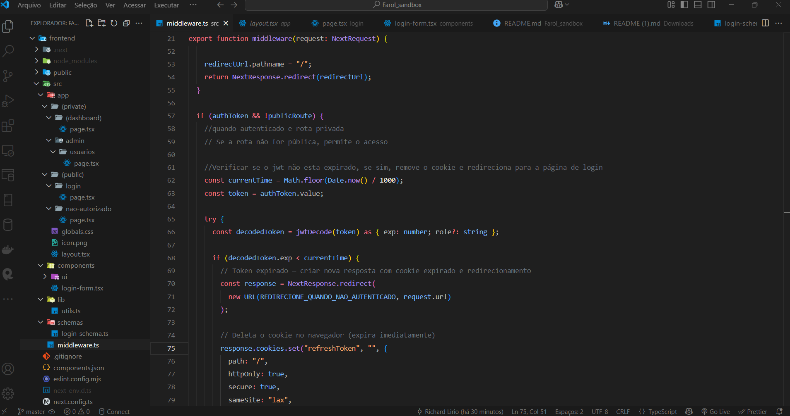

# 🔐 Farol Web — Autenticação com JWT no Frontend (Next.js)

Projeto criado com o objetivo de **praticar e assimilar conceitos modernos de autenticação JWT no frontend**, utilizando **Next.js (App Router)**, cookies HttpOnly e controle de acesso baseado em permissões.

---

## 🚀 Tecnologias Utilizadas

- **Next.js (App Router)**
- **TypeScript**
- **Tailwind CSS + ShadCN UI**
- **JWT (Json Web Token)**
- **React Hook Form + Zod** (validação de formulários)
- **Lucide React** (ícones)
- **Sonner** (toasts de feedback)

---

## 🎯 Objetivo

O projeto visa simular um fluxo de login completo com:

- ✅ Validação de dados com **Zod**
- ✅ Envio de credenciais para o backend em `http://localhost:3333/sessions`
- ✅ Armazenamento seguro do token JWT em **cookies HttpOnly**
- ✅ Middleware protegendo rotas privadas e removendo cookies expirados
- ✅ Controle de acesso baseado no campo `role` do token JWT
- ✅ Redirecionamentos automáticos conforme o estado de autenticação
- ✅ Página de **“Acesso não autorizado”** para usuários sem permissão

---

## 🗂️ Estrutura de Pastas

```
frontend/
   |──src/
      ├──app/                       # Páginas e rotas (App Router)
      │   ├── (private)/            # Páginas privadas
      │   |    ├── (dashboard)/     # Página com o dashboard
      │   |    ├── admin/           # Rota com as Páginas com acessos restritos por cargo
      │   |    |   ├── usuarios/    # Páginas de gerenciamento de usuários
      │   ├── (public)/             # Páginas publicas
      |   │    ├── login/           # Página pública para login
      |   │    └── nao-autorizado/  # Página publica para usuários não autorizados
      ├── components/               # Componentes reutilizáveis
      |   ├── ui/                   # Componentes UI do ShadCN
      ├── lib/                      # Utilitários
      ├── schemas/                  # Schemas Zod
      ├── middleware.ts             # Middleware de autenticação
```

---

## 🧠 Fluxo de Autenticação

1. Usuário acessa `/login` e envia email/senha
2. Backend responde com JWT (armazenado como cookie HttpOnly)
3. Middleware intercepta cada requisição:
   - Verifica se o token existe
   - Verifica se está expirado (e remove se necessário)
   - Verifica o `role` no token e bloqueia rotas sensíveis se necessário
4. Redirecionamentos automáticos com base na autenticação e permissões

---

## 📥 Instalação e Execução

1. Clone o repositório:
   ```bash
   git clone https://github.com/RichardLirio/fluxoJwt_Next15
   ```

2. Instale as dependências:
   ```bash
   npm install
   ```

3. Inicie o servidor de desenvolvimento:
   ```bash
   npm run dev
   ```

> Certifique-se de que o backend (em `http://localhost:3333/sessions`) está rodando e enviando um JWT válido no cookie!

---

## 📸 Captura de tela

> Estrutura do projeto no VSCode



---

## 📚 Aprendizados

Esse projeto foi essencial para consolidar meus conhecimentos sobre:

- Autenticação baseada em JWT no frontend
- Controle de rotas com middleware no Next.js
- Manipulação segura de cookies HttpOnly
- Organização escalável de projetos frontend modernos

---

## 🧑‍💻 Autor

**Richard Lirio**

- GitHub: [github.com/RichardLirio](https://github.com/RichardLirio)  
- LinkedIn: [linkedin.com/in/richard-silva-lirio-b97484250](https://www.linkedin.com/in/richard-silva-lirio-b97484250)

---

## 📄 Licença

Este projeto é apenas para fins educacionais e de aprendizado.
